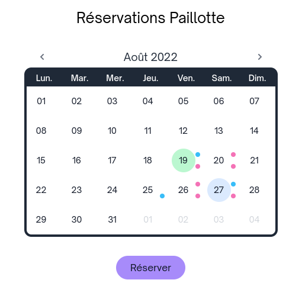
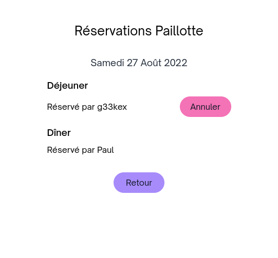

# Hut

I needed a web app to allow people from my building to book a shared kitchen area for lunch or dinner. I couldn't find such an app so I made one with the Phoenix framework and Tailwind CSS. This is my first web app so please forgive the inefficiencies. 
 
The main view is a calendar view that allows picking a day to book a slot. It also shows slots that are already booked. The booking view allows to put down your name on a slot to book it or to cancel your booking. You cannot cancel other people's bookings because your booking is tied to your session cookie.

## Screenshots





## Running

Just as with any other Phoenix app, run:

```
mix deps.get
mix compile
mix ecto.setup
mix phx.server
```
